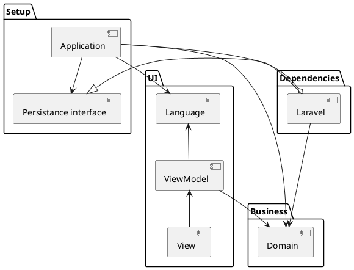

```plantuml
@startuml

package "Business" {
  [Domain]
}

package "Setup" {
  component [Application] as App
  component "Persistance interface" as Persistance
}

package "UI" {
  [Language] <-- [ViewModel]
  [ViewModel] <-- [View]
  [ViewModel] --> Domain
}

package "Dependencies" {
  [Laravel]
}

Laravel --|> Persistance
Laravel -->  Domain

App --> Domain
App --> Language
App --> Persistance
App --o Laravel

@enduml
```
